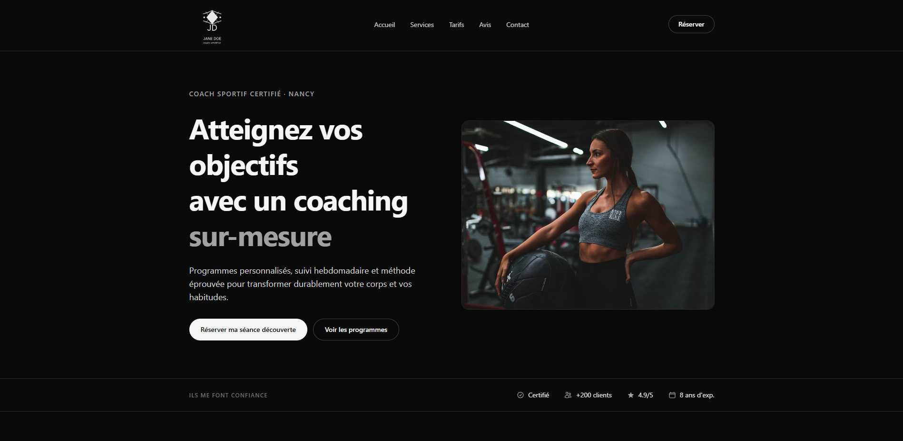

# 💪 Coach Sportif — Landing Page

> Landing page fictive pour une coach sportive, développée dans le cadre d'un projet pédagogique étudiant.

[](https://astro.build)
[](https://vuejs.org)
[](https://tailwindcss.com)
[](https://www.typescriptlang.org)
[](https://vercel.com)

## 🌐 Démo en ligne

👉 **[coach-sportif-landing.vercel.app](https://coach-sportif-landing.vercel.app/)**

<p align="center">
  
</p>

## 📋 À propos

Ce projet est une **landing page complète** pour une coach sportive fictive (Jane Doe), développée pas à pas dans un objectif **pédagogique**. L'objectif était d'apprendre :

- ⚙️ Les **frameworks modernes** (Astro + Vue.js)
- 🎨 Le **CSS utility-first** avec Tailwind CSS v4
- 🟦 Le **TypeScript strict** dans un vrai projet
- 🔀 Le **workflow Git pro** (branches, commits atomiques, Pull Requests, code review)
- 🚀 Le **déploiement** avec CI/CD via Vercel

Le projet ne contient **aucun backend** : tout est statique côté frontend, avec quelques îlots interactifs en Vue.

## ✨ Fonctionnalités

### 🎨 Design
- **Dark theme** moderne avec accents minimalistes
- **Logo personnalisé** SVG
- **Responsive** mobile-first (mobile / tablette / desktop)
- **Animations au scroll** via Intersection Observer API
- **Glassmorphism** sur la navbar sticky
- **Scroll smooth** natif avec compensation pour navbar sticky

### 🧩 Composants
- **11 sections** complètes (Navbar, Hero, Trust, About, Services, Méthode, Tarifs, Témoignages, FAQ, Contact, Footer)
- **Menu burger mobile** avec overlay plein écran (Vue)
- **FAQ accordéon** interactive (Vue)
- **Formulaire de contact** avec validation côté client (Vue)
- **Composants UI réutilisables** : Button, Icon, ServiceCard, StepCard, PricingCard, TestimonialCard, Reveal

### 🔍 SEO & Performance
- Meta tags complets (Open Graph, Twitter Card)
- Données structurées **JSON-LD** (Schema.org LocalBusiness)
- Favicon custom
- `robots.txt` configuré
- **Lazy loading** des images
- **Architecture des îlots** Astro (Vue chargé uniquement où nécessaire)

### ♿ Accessibilité
- HTML sémantique (`<header>`, `<nav>`, `<section>`, `<footer>`, `<blockquote>`)
- Attributs ARIA (`aria-label`, `aria-expanded`, `role="dialog"`, etc.)
- Respect de `prefers-reduced-motion`
- Navigation clavier complète
- Texte alternatif sur toutes les images

## 🛠️ Stack technique

| Catégorie | Technologie |
|-----------|-------------|
| **Framework** | [Astro 5](https://astro.build) |
| **UI Interactive** | [Vue 3](https://vuejs.org) (Composition API + `<script setup>`) |
| **Styles** | [Tailwind CSS v4](https://tailwindcss.com) |
| **Langage** | TypeScript (strict mode) |
| **Hébergement** | [Vercel](https://vercel.com) |
| **Versioning** | Git / GitHub |

## 🚀 Installation locale

### Prérequis
- [Node.js](https://nodejs.org) v20 ou plus
- [npm](https://www.npmjs.com) v10 ou plus
- [Git](https://git-scm.com)

### Étapes

```bash
# 1. Cloner le repo
git clone https://github.com/VOTRE-USERNAME/coach-sportif-landing.git
cd coach-sportif-landing

# 2. Installer les dépendances
npm install

# 3. Lancer le serveur de développement
npm run dev
```

Le site sera accessible sur **[http://localhost:4321](http://localhost:4321)**.

### Scripts disponibles

| Commande | Description |
|----------|-------------|
| `npm run dev` | Démarre le serveur de développement |
| `npm run build` | Build le projet pour la production (dossier `dist/`) |
| `npm run preview` | Preview la version de production en local |
| `npm run astro` | Accès au CLI d'Astro |

## 📁 Structure du projet

```
coach-sportif-landing/
├── docs/                      # Documentation
│   └── screenshot.png
├── public/                    # Assets statiques
│   ├── favicon.svg
│   ├── logo.svg
│   └── robots.txt
├── src/
│   ├── components/
│   │   ├── sections/          # Sections principales de la page
│   │   ├── ui/                # Composants UI réutilisables
│   │   └── seo/               # Composant SEO
│   ├── layouts/
│   │   └── Layout.astro       # Layout principal (HTML + meta tags)
│   ├── pages/
│   │   └── index.astro        # Page d'accueil
│   └── styles/
│       └── global.css         # Styles globaux + Tailwind
├── astro.config.mjs
├── tsconfig.json
└── package.json
```

## 🎓 Apprentissages clés

Ce projet m'a permis de découvrir et pratiquer :

- 🏝️ **L'architecture des îlots** (Astro) : envoyer du HTML statique partout et activer JavaScript uniquement où c'est nécessaire
- 🔄 **La Composition API de Vue 3** avec `ref`, `computed`, `watch`, `onMounted`
- 🎨 **Tailwind utility-first** : composer le design uniquement via les classes
- 👁️ **L'Intersection Observer API** native pour les animations au scroll performantes
- 🪄 **Les sélecteurs CSS modernes** (`:has()`, `supports-[]:`)
- ♿ **Les bonnes pratiques d'accessibilité** (ARIA, sémantique, `prefers-reduced-motion`)
- 🔀 **Le workflow Git professionnel** : branches par feature, Conventional Commits, Pull Requests
- 🚀 **Le déploiement automatisé** via Vercel + GitHub

## 📄 Crédits

- **Photos** : [Unsplash](https://unsplash.com) (libres de droits)
- **Icônes** : [Heroicons](https://heroicons.com)
- **Inspiration design** : wireframe personnalisé

## 📝 Licence

Projet pédagogique — utilisation libre à des fins d'apprentissage.

---

> 🎓 **Note** : Le contenu de cette landing page est entièrement **fictif**. Jane Doe est un personnage inventé pour les besoins du projet pédagogique.